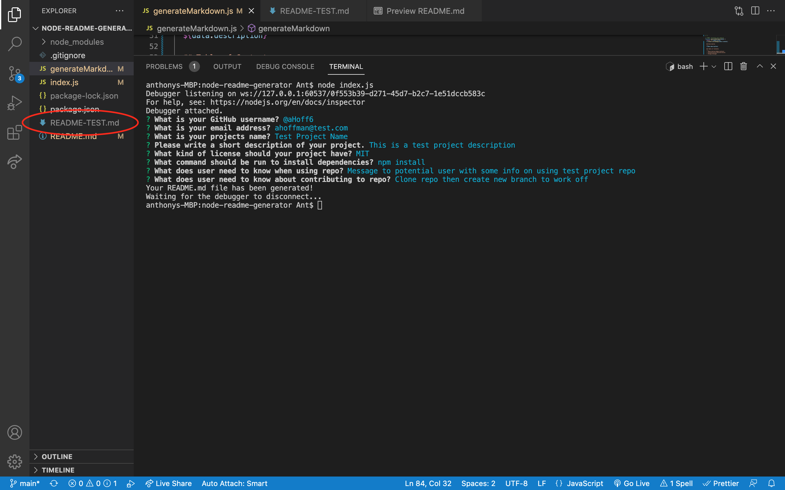
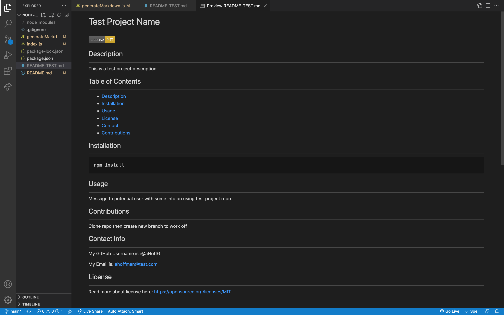

# node-readme-generator

## Description
---
As a web developer, I want to write professional and descriptive README files. This node README generator is a useful tool for those looking to create quality readme files quickly.

## Usage
---
To use this README generator just install required dependencies and run the index.js file in the terminal. You will be met with prompts in the terminal to gather all required fields necessary to complete making the your readme file.

## Installation
---
To install this project to get the development environment running:

1. Clone GitHub repository here: https://github.com/aHoff6/node-readme-generator
by clicking the green "code" button and copying the URL.

2. Open the Command Line and change the directory to where you would like to clone the directory.

3. Type the command "git clone" followed by the URL you copied earlier and press enter.

4. Run `npm install` to install dependencies.

5. Then run `node index.js` to begin readme generator.

## Reference picture
---

